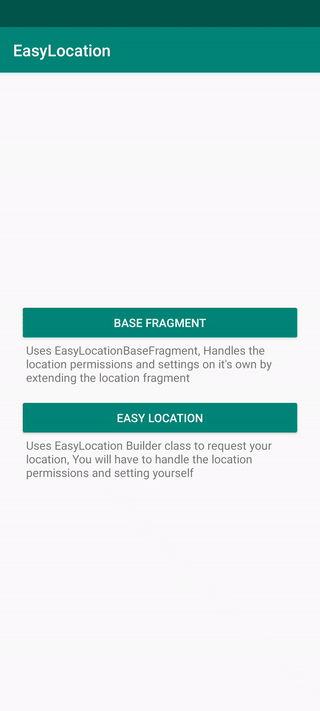

# Introduction
[](https://developer.android.com/index.html)

[](http://www.apache.org/licenses/LICENSE-2.0)

Working with location is one of the most common tasks in the development process of mobile apps.
Therefore, questions about what to use to achieve more precise results, maximum stability in operation and 
simplicity of implementation frequently arise during the development.

EasyLocation is built to ease this frequent task by using just a few lines of code, But providing a powerful, wide and compact features too.



#Setup
Either use Gradle:
```
implementation 'com.linkdev.easylocation:easylocation:1.0.0'
```
or Maven:
```
<dependency>
  <groupId>com.linkdev.easylocation</groupId>
  <artifactId>easylocation</artifactId>
  <version>1.0.0</version>
  <type>pom</type>
</dependency>
```

Needs location permissions based on your needs to be added to the manifest:
```
    <uses-permission android:name="android.permission.ACCESS_COARSE_LOCATION" />
    <uses-permission android:name="android.permission.ACCESS_FINE_LOCATION" />
    <uses-permission android:name="android.permission.ACCESS_BACKGROUND_LOCATION" />
```

# How to use EasyLocation
There are multiple ways to use EasyLocation depending on your business using:
1.  EasyLocationBaseFragment
2.  EasyLocation

##EasyLocationBaseFragment
* The fastest way, just make the fragment extend from the `EasyLocationBaseFragment`.
* Will handle the permissions checks and settings for you.

Just extend `EasyLocationBaseFragment` and call `getLocation` whenever you need the location
```kotlin
    getLocation(
        locationOptions = TimeLocationOptions(),
        locationRequestType = LocationRequestType.ONE_TIME_REQUEST,
        locationRequestTimeout = 50000,
        rationaleDialogMessage = "Location permission is required to be able to use this feature"
    )
```
You will receive the callbacks in implemented methods
```kotlin
    override fun onLocationRetrieved(location: Location) {
        // TODO Use non-null retrieved location
    }

    override fun onLocationRetrievalError(locationResultError: LocationResultError) {
        // TODO Handle location different errors
        when (locationResultError.errorCode) {
           LocationErrorCode.LOCATION_SETTING_DENIED, // Location settings is off
           LocationErrorCode.LOCATION_PERMISSION_DENIED, // Location permissions was denied
           LocationErrorCode.UNKNOWN_ERROR, // Unexpected error
           LocationErrorCode.TIME_OUT -> // The location request has timed out without any response from the location provider
               Toast.makeText(mContext, locationResultError.errorMessage, Toast.LENGTH_LONG)
                    .show()
           LocationErrorCode.PROVIDER_EXCEPTION -> // Returned When there is a known error from the provider returned with the exception.
                val exception: Exception? = locationResultError?.exception
       }
    }
```
If you prefer composition check out [EasyLocation](#easylocation)

## EasyLocation
* If you want to handle permissions on your own.
Using the `EasyLocation` Builder class you initialize the object and call requestLocationUpdates like below:
```kotlin
    mEasyLocation = EasyLocation.Builder(mContext, TimeLocationOptions())
        .setLocationRequestTimeout(50000)
        .setLocationRequestType(LocationRequestType.ONE_TIME_REQUEST)
        .build()

    mEasyLocation.requestLocationUpdates(lifecycle)
        .observe(this, this::onLocationResult)

    private fun onLocationResult(locationResult: LocationResult) {
        when (locationResult.status) {
            Status.SUCCESS -> {
                val location: Location = locationResult.location
                // Handle on location result success
            }
            Status.ERROR ->
                // TODO Handle location different errors
                when (locationResultError.errorCode) {
                   LocationErrorCode.LOCATION_SETTING_DENIED, // Location settings is off
                   LocationErrorCode.LOCATION_PERMISSION_DENIED, // Location permissions was denied
                   LocationErrorCode.UNKNOWN_ERROR, // Unexpected error
                   LocationErrorCode.TIME_OUT -> // The location request has timed out without any response from the location provider
                       Toast.makeText(mContext, locationResultError.errorMessage, Toast.LENGTH_LONG)
                            .show()
                   LocationErrorCode.PROVIDER_EXCEPTION -> // Returned When there is a known error from the provider returned with the exception.
                        val exception: Exception? = locationResultError?.exception
               }
        }
    }
```
`requestLocationUpdates()` returns a `LiveData` object in which you will receive future location updates based on provided `LocationOptions`.

#Customizations
For extra customizations check below
##set location options settings
Sets the settings for the location
```kotlin
    mEasyLocation = EasyLocation.Builder(mContext, locationOptions)
```
Can be one of `TimeLocationOptions` or `DisplacementLocationOptions`
###TimeLocationOptions
When you are interested in the location updates in a timely manner, customized params:\
`TimeLocationOptions(interval Long ,fastestInterval Long ,priority EasyLocationPriority)`
* **interval** Desired interval for every location update in milliSeconds **Default:** 3 Seconds.
* **fastestInterval** Explicitly set the fastest interval for location updates, in milliseconds **Default:** 1 Seconds.
* **priority** Sets the quality of the request. **Default:** `EasyLocationPriority.PRIORITY_HIGH_ACCURACY`

###DisplacementLocationOptions
When you are interested in the location updates in a timely manner, customized params:\
`DisplacementLocationOptions(smallestDisplacement Float ,fastestInterval Long ,priority EasyLocationPriority)`
* **smallestDisplacement** Set the minimum displacement between location updates in meters **Default:** 5 meters.
* **fastestInterval** Explicitly set the fastest interval for location updates, in milliseconds **Default:** 1 Seconds.
* **priority** Sets the quality of the request. **Default:** `EasyLocationPriority.PRIORITY_HIGH_ACCURACY`


##set location request timeout - optional
Sets the max wait time in millisecond for the location update after the request is made or the last update is retrieved,
If exceeded the request will stop and return `LocationErrorCode.TIME_OUT`.
```kotlin
EasyLocation.Builder(mContext, TimeLocationOptions())
        .setLocationRequestTimeout(50000)
```
**Default:** `50000`

##set location request type - optional
Based on your business and needs for location updates select one of:
* **ONE_TIME_REQUEST** Return the location only once and then automatically cancel the location updates, Use if you need to know the current location.

* **FETCH_LAST_KNOWN_LOCATION** Return the last known location of the device

* **UPDATES** If should continue returning every update of the location updates.

**Default:** `LocationRequestType.UPDATES`

# Contribute
Contributions and contributors are always welcome! Help us make EasyLocation better and give back to the community.

Found an issue or feel like contributing? Please use [Github][issues]
Have a question? Please use Stackoverflow with tag [easylocation_linkdev][stackoverflow]

# License
    Copyright 2020-present Link Development

    Licensed under the Apache License, Version 2.0 (the "License");
    you may not use this file except in compliance with the License.
    You may obtain a copy of the License at

        http://www.apache.org/licenses/LICENSE-2.0

    Unless required by applicable law or agreed to in writing, software
    distributed under the License is distributed on an "AS IS" BASIS,
    WITHOUT WARRANTIES OR CONDITIONS OF ANY KIND, either express or implied.
    See the License for the specific language governing permissions and
    limitations under the License.

 [issues]: https://github.com/EasyLocation/issues
 [stackoverflow]: http://stackoverflow.com/questions/tagged/easylocation_linkdev
